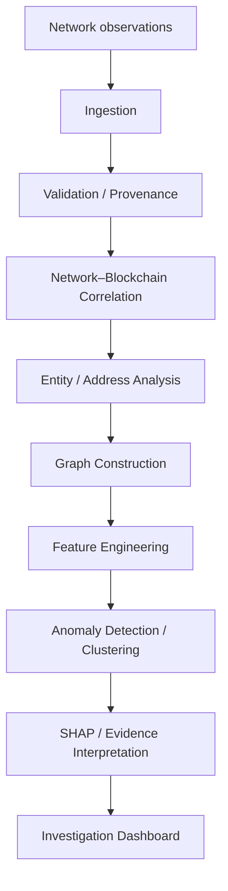

# CryptoNexus

**AI-Powered Monitoring & Analysis of Bitcoin Transaction Traffic**

[](https://github.com/buildwithrehman/Crypto-nexus/releases) 
[](https://github.com/buildwithrehman/Crypto-nexus/releases/tag/v1.0.0) 
[](#project-structure)

CryptoNexus is an offline investigation platform that correlates Bitcoin network observations with blockchain transaction metadata, detects structural anomalies, and presents explainable investigative evidence through an interactive analysis interface.

---

## Why CryptoNexus?

Traditional blockchain analysis primarily examines on-chain data (addresses, UTXOs), ignoring the origin of the broadcast traffic. CryptoNexus adds a network-observation layer, providing investigators with an offline, privacy-preserving tool to correlate observed IP broadcasts with transactional structures. This surfaces behavioral patterns and structural anomalies without relying on cloud APIs or external data leaks.

## What It Does

- **Network ↔ Blockchain Correlation:** Link network broadcast observations directly to transaction entities.
- **Anomaly Detection:** Leverage unsupervised ML (HDBSCAN) to identify structural outliers.
- **Graph Analysis:** Explore localized subsets of the transaction graph via an interactive UI.
- **Address Clustering:** Identify common-control hypotheses through structural heuristics.
- **Explainable Evidence:** Render SHAP-based evidence to explain precisely why a transaction was flagged.
- **Local GeoIP Enrichment:** Map observations to locations using an embedded MaxMind database.

## Architecture



## Offline by Design

CryptoNexus is designed to operate completely offline in secure, air-gapped environments:

- **Runs locally:** Entire application stack runs natively on `127.0.0.1`.
- **Zero Runtime Cloud Dependency:** No external APIs, CDNs, or Google Fonts.
- **Self-Contained Data:** Uses embedded DuckDB, local packaged `joblib` models, and a local GeoIP `mmdb`.
- **No Telemetry:** Total privacy and strict provenance during investigations.

## Demo

The release comes pre-packaged with the verified **DEMO_V1** dataset:
- **25,649** transactions
- **60,355** network observations
- **1,283** alerts
- **2,697,262** evidence records

## Get the Jury Release

**Important:** A fresh `git clone` alone is not sufficient to run the complete application, as large databases and ML artifacts are intentionally excluded from Git history. 

Download **v1.0.0 (Offline Jury Release)** directly from the [GitHub Releases](https://github.com/buildwithrehman/Crypto-nexus/releases/tag/v1.0.0) tab.

**SHA-256:** `53bcf754a166c8f88aa9b9dbb1b774073e81fb091486164e7eb393f0ed76544a`

## Quick Start

*After downloading the `CryptoNexus_Offline_Jury_Release_FINAL.tar.gz` archive:*

```bash
# 1. Extract the release archive
tar -xzf CryptoNexus_Offline_Jury_Release_FINAL.tar.gz
cd CRYPTONEXUS_FINAL_RELEASE

# 2. Create and activate a Python 3.11 virtual environment
uv venv --python 3.11 .venv
source .venv/bin/activate

# 3. Install required packages
uv pip install -r requirements.txt

# 4. Start the application
python -m uvicorn backend.api.main:app --host 127.0.0.1 --port 8000
```
Access the Investigation Dashboard at: `http://127.0.0.1:8000`

## Evidence Semantics & Limitations

- Bitcoin addresses are pseudonymous.
- Address ≠ wallet ≠ entity.
- IP association ≠ ownership.
- GeoIP is enrichment, not identity.
- Network observation timestamp is not necessarily blockchain confirmation time.
- Collaborative transaction patterns can affect heuristics.
- Minimum input data does not establish exact UTXO lineage.
- Anomaly ≠ crime.
- Investigative leads require further human investigation.

## Technology Stack

- **Backend:** Python 3.11, FastAPI, Uvicorn
- **Frontend:** React, TypeScript, Vite, TailwindCSS
- **Database:** DuckDB (Embedded)
- **Machine Learning:** HDBSCAN, SHAP, Scikit-learn
- **Data Processing:** Pandas, NetworkX

## Project Structure

```text
Crypto-nexus/
├── backend/          # FastAPI server, ML inference, and DB connectors
├── frontend/         # React SPA source code
│   ├── dist/         # Bundled static assets
│   └── src/          # UI Components
├── data/             # Demo dataset and GeoLite databases
├── ml_artifacts/     # Directory for trained models
├── tests/            # Pytest suite
├── reports/          # Audit documentation
├── requirements.txt  # Python dependencies
└── setup.sh          # Environment bootstrapping script
```

## Verification

- **Frontend:** Lint (PASS) | Production Build (PASS) | Browser Validation (PASS)
- **Packaged Smoke Test:** PASS (DEMO_V1 exact counts matched)
- **Backend:** 186 passed | 6 known DuckDB persistent-test-state failures | 18 warnings
- **Linux Execution:** UNVERIFIED in the current development environment.

## Smart India Hackathon

CryptoNexus was developed and architected specifically as a prototype for the **Smart India Hackathon (SIH)**.
